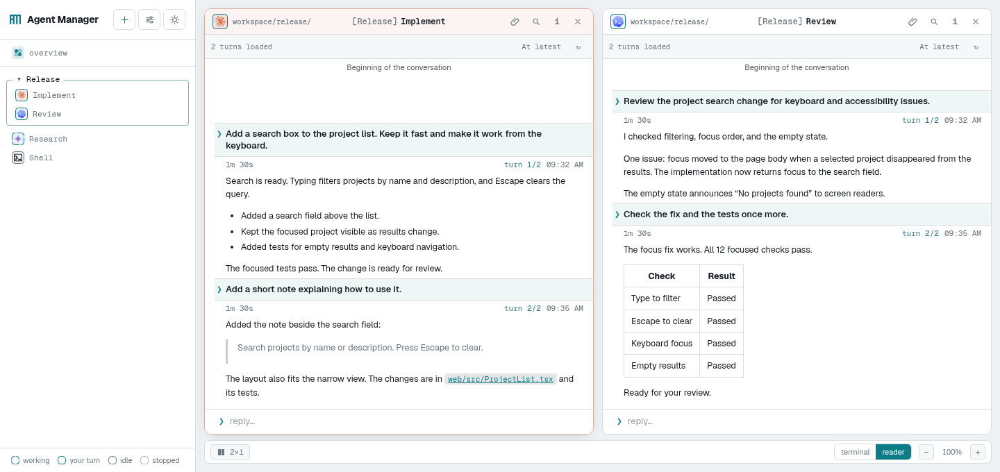

# Agent Manager

**Your coding agents, together in one private workspace.**

Run Claude Code, Codex, Gemini CLI, opencode, Hermes, OpenClaw and fx from your
browser. Follow several tasks side by side, read the conversation or open the
terminal, and pick up from another device while your Space stays running.

[**Create your private Space →**](https://huggingface.co/spaces/lvwerra/agent-manager-template)
· [Get started](#get-started)
· [Development](docs/development.md)
· [Report an issue](https://github.com/huggingface/agent-manager/issues)



*The current interface with example conversations.*

## What you can do

- **Keep several tasks in view.** Group sessions by project, arrange them side by
  side, and use Overview to see who is working and whose reply needs your attention.
- **Read at the level you need.** Switch between the live terminal and a
  conversation reader with formatted replies, expandable tool activity, search,
  and earlier history. Reader support depends on the agent's transcript format.
- **Work with your files.** Browse workspace folders, preview and edit files,
  upload documents or screenshots, and keep a shell beside your agents.
- **Give agents shared context.** Manage reusable skills in one place and let
  agents discover, message, and wait for other sessions through the local API.
- **Check usage and schedule work.** See token usage, estimated costs, and
  available quota information; schedule prompts and enable device notifications.
  Available usage details vary by provider.
- **Bring another machine.** Connect an agent running on your laptop or a remote
  server to the same workspace's conversation view.

Each session has its own conversation. Sessions can share a folder when you want
them to work on the same project; groups organize the interface and do not isolate
files or credentials. Use your own provider login or API keys.

## Get started

You need a Hugging Face account and access to at least one supported coding agent.
The app runs in a Docker Space; a **private storage bucket mounted at `/data`**
keeps your files, logins, and conversation history across restarts.

1. Open the [Agent Manager template](https://huggingface.co/spaces/lvwerra/agent-manager-template)
   and choose **⋮ → Duplicate this Space**. Set visibility to **Private**.
2. In your new Space's **Settings → Storage Buckets**, create or select a
   **private** bucket, mount it at **`/data`**, and use **read-write** access.
   Do this before signing in to agents. See the
   [Hugging Face storage guide](https://huggingface.co/docs/hub/spaces-storage)
   for the mount controls.
3. Once the Space is running, open the app, press **+**, choose an agent, and
   select its workspace folder. Follow that agent's first-run sign-in in its
   terminal. You can also add provider API keys under the Space's **Secrets**.
4. Send your first task. Add another session to review it, or create a group to
   keep both in view. **Overview** brings you back to all your sessions.

> **Keep both the Space and its bucket private.** Agent Manager has no login of
> its own: anyone with access to the app can use its shell and logged-in agents.
> The public template is an installation page. The
> [privacy lock](docs/privacy-lock.md) helps detect an exposed instance.

Agent Manager is open source under Apache 2.0. Your agent subscriptions or API
usage, Space hardware, and storage follow their providers' billing.

<details>
<summary>Set up the Space and bucket with Python instead</summary>

Install the Hub client and sign in with an account that can create Spaces and
buckets in your namespace:

```bash
pip install -U huggingface_hub
hf auth login
```

Replace `your-username` in both names, then run:

```python
from huggingface_hub import HfApi, Volume, create_bucket

api = HfApi()
space_id = "your-username/agent-manager"
bucket_id = "your-username/agent-manager-data"

create_bucket(bucket_id, private=True, exist_ok=True)
api.duplicate_repo(
    from_id="lvwerra/agent-manager-template",
    to_id=space_id,
    repo_type="space",
    private=True,
    space_volumes=[
        Volume(type="bucket", source=bucket_id, mount_path="/data"),
    ],
)
```

Open `https://huggingface.co/spaces/your-username/agent-manager` when the build
finishes, then continue from step 3 above. To attach a bucket to an existing
Space, use the same Settings controls or the
[Hub volume API](https://huggingface.co/docs/huggingface_hub/guides/manage-spaces#mount-volumes-in-your-space).

</details>

## What happens when you leave?

Closing the browser or switching devices does **not** stop your agents. They run
in the Space's backend as long as the Space stays awake.

A Space sleep, restart, or rebuild ends running processes. With the bucket
mounted, saved workspace files and checkpointed CLI state survive. Agent Manager
can restart eligible sessions and resume conversations where the CLI supports it;
it cannot preserve a running shell command through a reboot. Configure this in
**Settings → General → Restart sessions after a reboot**.

Without a bucket, local files and logins are temporary. For details on what is
saved, see [state checkpoints](docs/agent-state-checkpoints.md) and
[bucket backups](docs/bucket-backup.md).

## Go further

| Task | Guide |
| --- | --- |
| Manage shared skills | [Managed skills](docs/managed-skills.md) |
| Run prompts on a schedule | [Scheduled prompts](docs/cron-jobs.md) |
| Connect an agent on another machine | [Remote agents](docs/remote-agents.md) |
| Upload files and follow file links | [Uploads](docs/workspace-file-uploads.md) · [File previews](docs/file-links.md) |
| Inspect session operations | [API log](docs/api-audit-log.md) |
| Run the source or deploy a development Space | [Development guide](docs/development.md) |

Contributions and bug reports are welcome on
[GitHub](https://github.com/huggingface/agent-manager). Include your agent type,
browser, and steps to reproduce when reporting a problem. For a security issue,
see [SECURITY.md](SECURITY.md).
